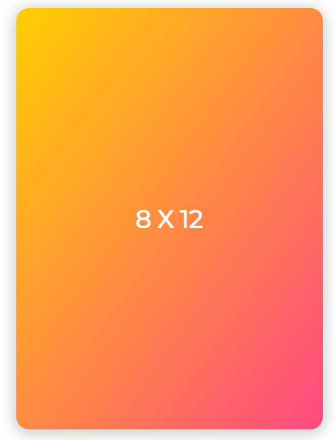

# Math in a Flash  

## Description    
A JavaScript flashcard application to help kids learn their times tables.  

## Table of Contents

* [Technologies Used](#technologies-used)

* [How to Use](#how-to-use)     

* [How and Why I Made This](#how-and-why-i-made-this)  

* [Deployed Application](#link-to-deployed-application)

* [GitHub Repo](#link-to-github-repo)

* [Future Development Ideas](#future-development-ideas)  

## Technologies Used    
Built in Visual Studio with          
HTML       
CSS    
Javascript           

## How to Use      
Navigate to https://alyssahellrung.github.io/mathFlashCards. Right away, you will be presented with the first math problem.  
  
When you click anywhere on the card, it will flip over to reveal the answer.     
     
You can click on the card as many times as you want to see the question and answer, but when you are ready to move to the next question, click the "Next Card" button and you will see the next problem.  
       
Every time you load the app, the cards will shuffle, so you will get the cards in a different order each time!  

    

## How and Why I Made This    
My daughter is learning her times tables, so I made her some physical flashcards on paper to help with memorization. As I was writing them all out, I thought, "Why not just make an app for this?" I found an excellent card-flipping animation tutorial by Tyler Potts (https://tinyurl.com/8g4krws9) for the action of the cards. I chose to bring in the data and shuffle it (using the Durstenfeld shuffle) so that the user is presented with the problems in a different order every time.

## Link to Deployed Application  
https://alyssahellrung.github.io/mathFlashCards

## Link to GitHub Repo      
https://github.com/alyssahellrung/mathFlashCards

## Future Development Ideas     
--Because the math problems come from a data file, this code is extremely reusable. One could add more data files and switch between them. I want to try this with French vocabulary words, but you could use the cards for anything.  
--Improve appearance on very small screens (not very responsive yet on tiny phones).